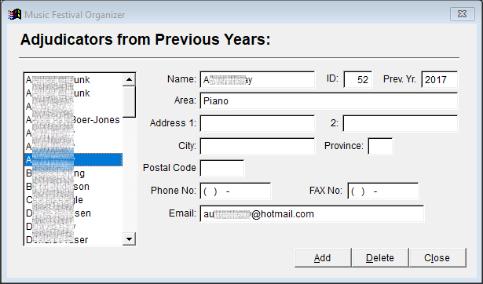
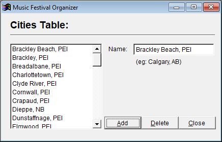

## Top level menu

* File
* History
* Setup
* Entries
* Schedule
* Results
* Volunteers
* Help

## File

* Backup
* Restore
* Export -->
* Import -->
* Updates -->
* Utilities -->
* Exit

### Backup

Backs all data to a ZIP archive

### Restore

Restores all data from a ZIP archive

### Export

* Certificate data to spreadsheet
* Class counts to spreadsheet
* Festival program text files
* Festival program class numbers in program order
* Marks data export to spreadsheets
* Music library table to online entries
* Participant data
* Syllabus data for online entries
* Volunteer email addresses to spreadsheet
* Volunteer data to spreadsheet

### Import

* Online entries
  * Asks to select file to import a .zip file
* Provincial entries data
  * Askes to select .csv or .xls file

### Updates

* Display update log
  * Shows screen with contents of a log file showing when updfates occurred
  * Not clear what an "update" is
* Update table structures
  * shows list of problems when updating table structure
  * not clear what the original update are...

### Utilities

* Delete all online entries
* Merge duplicate participants
  * Opens the *MFO - ENTRIES* window
* Repair music selection minutes data
  * no interaction. displays window saying cleanup successfully completed
* Cleanup Music Library
  * Nothing happens
* Recreate all index values for all tables
  * no interaction. displays window saying reindex successfully completed
* Remove all empty records from Entries Table
  * no interaction. displays window saying successfully completed
* Clear unmatched participants from Participant History Table
  * no interaction. displays window saying successfully completed
* Re-assign teacher IDs
  * no interaction. displays window saying successfully completed
* Add accompanists (for online entries after importing)
  * no interaction. displays window saying successfully completed
* Create ensemble records for all online ensembles (duets, trios, etc.)
  * Does not seems to "create" anything
  * Displays a window listing ensembles and the participants in each
* Calculate age in years for dance ensemble members
  * Nothing happens
* Add performance times from syllabus
  * Seems to have a record of values recorded in syllabus
  * Askes you to confirm to replace manually entered times with times from syllabus, or to replace values only if current value is zero
* Trim '(Solo c)' from participant names
  * no interaction. displays window saying successfully completed
* Reset proper case
  * (hangs up)
* Add copies for online ensembles
  * "Ensemble participant records have been added to enable printing of letters and certificates for ensemble performers in online entries"
* Convert local to provincial class numbers
* Rename provincial classes
* Cleanup adjudicators table
  * opens window displaying table of adjudicator infpormation
* Tag local classes with 'D'
* Recreate session list
  * crashes program

## History

* Adjudicators
* Paricipants
* Reports

### Adjudicators

Opens a window showing the list of past adjudicators and their information. It seems like you can add, update, and delete records from this screen. See the screenshot below:

### Participants

Opens a window showing the list of past participants and their information. It seems like you can add, update, and delete records from this screen. See the screenshot below:

The *Locate a Perticipant* button opens a search dialog box:

### Reports

* Participants by Family
* Previous Participants List

#### Participants by Family

A multi-page report, suitable for printing, listing participants under last names. You may choose whether the list is "From History" or "From Current Year". 

Does not work and, even if it did, it does not seem useful.

#### Previous Participants List

A multi-page report, suitable for printing, listing participants information. You may choose whether the list is "From History" or "From Current Year". 

Does not work and, even if it did, it does not seem useful.

## Setup

* Accompanists
* Revise Accompanists
* Adjudicators
* Teachers
* Participants without Teachers
* Teacher Types
* Venues

* Cities
* Merge Cities, Teachers, and Accompanists

* Provincial Associations
* Member Festivals
* Local Festival

* Music Selections
* Syllabus
* Syllabus - Multi-Class View
* Standings

* Preferences
* Labels
* Reports

* Rollover

### Accompanists

Opens a window showing the list of accompanists and their information. It seems like you can add, update, and delete records from this screen. See the screenshot below:

### Revise accompanists

Opens a window that seems to enable user to find and correct duplicate entries? Not sure how this works.

### Adjudicators

Opens a window showing the list of adjudicators and their information. It seems like you can add, update, and delete records from this screen. See the screenshot below:

There is no data in this tool. Probably because no "current" adjudicators have been set up, or the "rollover" has not yet been done for adjudicators.

### Teachers

Opens a window showing the list of all music teachers on file and their information. It seems like you can add, update, and delete records from this screen. See the screenshot below:

### Participants without Teachers

This function does not work.

### Teacher Types

Opens a window showing the list of teacher types. It seems like you can add, update, and delete records from this screen. See the screenshot below:

### Venues

Opens a window showing the list of venuew. It seems like you can add, update, and delete records from this screen. See the screenshot below:

### Cities

Opens a window showing the list of cities. It seems like you can add, update, and delete records from this screen. See the screenshot below:

Not sure how this is useful...

### Merge Cities, Teachers, and Accompanists

Similar to "Revise Accompanists", opens a window that seems to enable user to find and correct duplicate entries? This is a generic "Merge Utility" that has tabs for Cities, Teachers, and Accompanists.

Not sure how this works.

### Provincial Associations

Opens a window that displays information about provincial music festivals. Not clear where this information is gathered.

### Member Festivals

Opens a window that displays information about "member" music festivals. Not clear where this information is gathered, or how it is associated with provincial festival.

### Local Festival

Opens a window that displays information about "member" music festivals. Not clear where this information is gathered, or how it is associated with member festival.

### Music Selections

Opens a window that displays information about music pieces. I assume these are added via an import function. The window allows user to search for pieces and make corrections to title and composer names.

### Syllabus

Opens a window that lets you edit classes in the syllabus.

### Syllabus - Multi-Class View

Opens a window that lets you edit classes in the syllabus in groups.

### Standings

Opens a window that lets you edit standings.

### Preferences

Nothing happens.

Normally, this is where you would enter your festival details, logo, etc...

### Labels

Provides options for printing address labels of teachers, for the purpose of addressing envelopes.

### Reports

Creates printable documents

* Accompanist list
  * name, address, phone
* Adjudicator list
  * ID, name, area
* Participant email list
  * Exports to Excel or test file
* Syllabus list
  * Lists class #, Class title, time
* Current Teacher contact list
  * Exports to excel
* Venue list
  * Venue ID, name, address

### Rollover

Push this button to start rollover from one year to the next.

## Entries

Most of the functions in this menu do not owrk. But, some of the reports are used offline to build a schedule.

### Add/Edit/Remove participants

Does not work

### Process online entries

Opens a form for processing online entries but does not work. Assume online entries are imported from a file.

### Locate a participant using class number

Does not work

### Refresh all fees

Does not work

### Reports

The reports currently used are in bold text below:

* Check for errors
  * Participants with no entries
  * Entries with no participant
  * Duplicate IDs
  * Duplicate participants
* Class count by participant
* Class lists
* Class tallies
* **Fees Payment Summary**
* Dance Ensembles - average age
* Entries count by age range
* Entries count by age for selected cities
* Entries count by genre 
* Entries count by genre, gender, and age
* Entries count by school
* Entries count by section
* Participant count by type
* Entry forms for online entries
* Multiple genre entries
* Participant list by city
* Participant email list
* Participant phone list
* Confirmation of entries by teacher
* Confirnation of entries by participant
* Summary of contacts
* Summary of entries by participant
* **Summary of entries by class #**
* Music selections by class # and participant

#### Fees Payment Summary

May sort by participant or teacher. May choose all fees or may select only outstanding fees.

#### Summary of entries by class #

### Labels

Generate envelope labels for all participants. Export as printable file or send to printer.

## Schedule

* Add/Edit sessions
* Locate session from class #
* Re-assign sections
* Change performance order
* Refresh all sessions
* Clear all sessions
* Labels
* Reports
* Reports - Provincial

### Add/Edit sessions

Does not work

### Locate session from class #

Find a session (which seems to be a time period in a venue)

Opens session builder

### Re-assign sections

Not sure what this does

### Change performance order

In a class, reorder the participants

### Refresh all sessions

No interaction. Seems to succeed.

### Clear all sessions

Asks if I want to delete all sessions. I said "no". Then nothing happened.

### Labels

More mailing labels for partipants

### Reports

Most reports do not work. The menu shows the intent of this section. The bold text shows the reports currently used.

* Check for errors
  * Conflicts
    * Participant conflicts
    * Accompanist conflicts
  * Duplicate schedules
  * Unscheduled classes
* Accompanist summary
* **Adjudicator's schedules**
* Adjudicator's music selections
* Adjudicator's sheets 
  * All
  * One session
  * Blank
* Festival program
  * **Local - MFO report**
  * Local - text
* Participant letters
  * All
  * One participant
  * One, many, or all teachers to PDF
* Participant's performance list
* Teacher summary - all
* Teacher summary - one, many, or all to PDF
* Venue setup notes
* Venue schedules
* Worksheets by session

#### Adjudicator schedules

For each adjudicator, their daily responsibilities. As seen below:

#### Local MFO report

A preliminary view of the schedule for each day as shown below:

#### Teacher summary - one, many, or all to PDF

#### Adjudicator's sheets

For all

For one participant

For one session

### Reports - Provincial

A summary per festival. Does not work

## Results

* Marks
* Awards

### Marks

Forms to award marks

### Awards

Forms to note awards

To create awards:

## Volunteers

## Help

